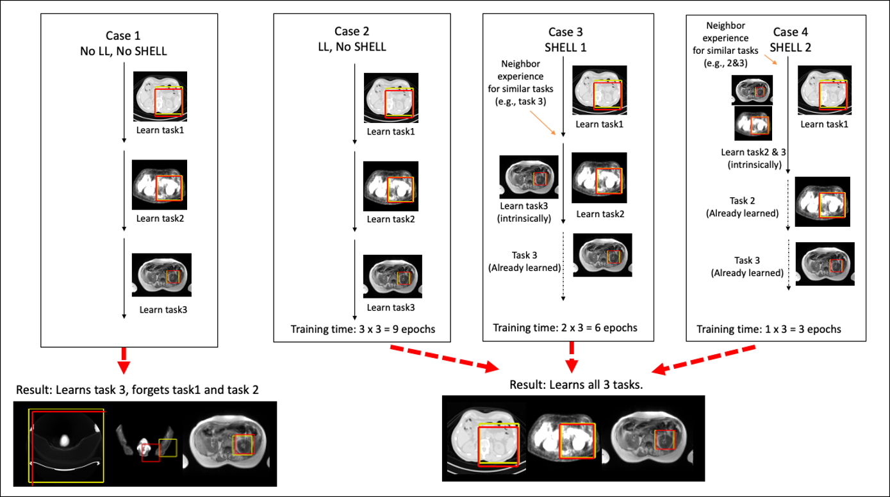

## Asynchronous Decentralized Federated Lifelong Learning

Artificial Intelligence (AI) techniques are increasingly being used in radiological applications. 
However, an increase in the number of applications where AI could be applied to radiology makes the maintenance 
and deployment of different AI models to radiology computationally very expensive. There are various intrinsic 
similarities across different AI models being evaluated in the field of radiology. For example, segmentation models
developed for multiparametric MRI would learn a similar signature for segmenting different tissue types 
irrespective of the underlying application being evaluated. Similarly, an AI model built for localizing organs in
a whole-body MRI, PET, or CT scan would share architectural (anatomical) similarities with AI models built 
for localizing neighboring organs such as pancreas or spleen. As a result, AI applications being built for newer 
tasks could significantly benefit from previously built AI architectures for similar or related tasks. The benefits
that could be observed in terms of reduced required computational power and time required to successfully train AI 
models for newer tasks. To that end, we are building the Asynchronous Decentralized Federated Lifelong Learning (ADFLL) framework to bring ShELL capabilities to medicine, in particular, radiology.

---
## Concept

<p align="center">
    
</p>

---

## Usage
```
usage: DQN.py [-h] [--gpu GPU] [--load LOAD] [--task {play,eval,train}]
              [--algo {DQN,Double,Dueling,DuelingDouble}]
              [--files FILES [FILES ...]] [--saveGif] [--saveVideo]
              [--logDir LOGDIR] [--name NAME] [--lr LR]
              [--max_epochs MAX_EPOCHS] [--agents AGENTS]
              [--reward_strategy REWARD_STRATEGY]
              [--prev_exp PREV_EXP [PREV_EXP ...]] [--no_erb]

optional arguments:
  -h, --help            show this help message and exit
  --gpu GPU             comma separated list of GPU(s) to use.
  --load LOAD           load model
  --task {play,eval,train}
                        task to perform. Must load a pretrained model if task
                        is "play" or "eval"
  --algo {DQN,Double,Dueling,DuelingDouble}
                        algorithm
  --files FILES [FILES ...]
                        Filepath to the text file that comtains list of
                        images. Each line of this file is a full path to an
                        image scan. For (task == train or eval) there should
                        be two input files ['images', 'landmarks']
  --saveGif             save gif image of the game
  --saveVideo           save video of the game
  --logDir LOGDIR       store logs in this directory during training
  --name NAME           name of current experiment for logs
  --lr LR               Learning rate to use while training
  --max_epochs MAX_EPOCHS
                        The maximum number of epochs to train for
  --agents AGENTS       Number of agents to train together
  --reward_strategy REWARD_STRATEGY
                        Which reward strategy you want? 1 is simple, 2 is line
                        based, 3 is agent based
  --prev_exp PREV_EXP [PREV_EXP ...]
                        Add any previous experience you want to use to avoid
                        catastrophic forgetting
  --no_erb              Flag specifying to NOT save ERB for lifelong learning
```

### Train
```
 python DQN.py --task train  --gpu 0 --files './data/filenames/image_files.txt' './data/filenames/landmark_files.txt'
```

### Train with Past Experience (Life Long Learning)
```
 python DQN.py --task train  --gpu 0 --files './data/filenames/image_files.txt' './data/filenames/landmark_files.txt' --prev_exp 'ERB1.obj' 'ERB2.obj' 'ERB3.obj'
```

The `ERB.obj` files are automatically saved during training to the folder specified by `logDir` (use flag `--no_erb` to 
disable saving the experience replay buffer). 

### Evaluate
```
python DQN.py --task eval  --gpu 0 --load data/models/DQN_multiscale_brain_mri_point_pc_ROI_45_45_45/model-600000 --files './data/filenames/image_files.txt' './data/filenames/landmark_files.txt'
```

### Test
```
python DQN.py --task play  --gpu 0 --load data/models/DQN_multiscale_brain_mri_point_pc_ROI_45_45_45/model-600000 --files './data/filenames/image_files.txt'
```

## Quick Runs

Bash scripts has been written to streamline the experimentation process. For example,
to generate pseudo labels in our experience sharing via pseudo labels experiment, 
view the script under `quick_runs/exp_sharing_pseudo_labels/gen_pseudo_labels.sh`. The script
provides a header comment to describe its purpose and also comments on the expected 
command line arguments. Reading these comments, we can generate pseudo labels for fat left knee
images using epoch 3 checkpoints with the command:

`bash ./quick_runs/exp_sharing_pseudo_labels/gen_pseudo_labels.sh fat 0 3`

Note that localization task number 0 is the ID for left knee. This mapping is 
available in the README located at `quick_runs/README.md`. 


### References
[1] Athanasios Vlontzos, Amir Alansary, Konstantinos Kamnitsas, Daniel Rueckert, and Bern-hard Kainz.  Multiple landmark detection using multi-agent reinforcement learning.  InInternational Conference on Medical Image Computing and Computer-Assisted Interven-tion, pages 262–270. Springer, 2019

[2] Parekh VS, E. BA, Braverman V, Jacobs MA: Multitask radiological modality invariant landmark localization using deep reinforcement learning. In: Proceedings of the Third Conference on Medical Imaging with Deep Learning. vol. 121. Proceedings of Machine Learning Research: PMLR; 2020: 588--600.

[3] Zheng G, Zhou S, Braverman V, Jacobs MA, Parekh VS. Selective experience replay compression using coresets for lifelong deep reinforcement learning in medical imaging. InMedical Imaging with Deep Learning 2024 Jan 23 (pp. 1751-1764). PMLR.
